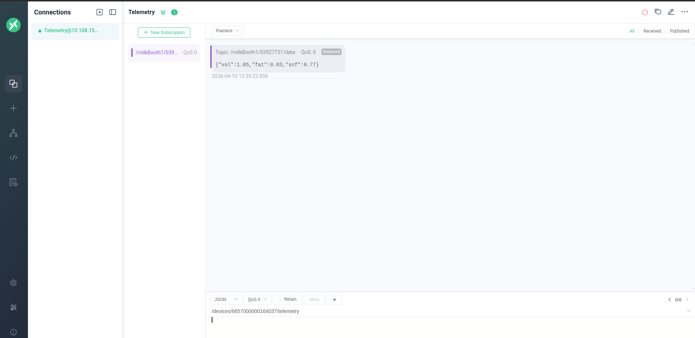

# Milk Procurement
In rural areas, most milk procurement from dairy farmers is done through dairy cooperative societies, e.g., TCMPFL (Tamil Nadu Cooperative Milk Producers' Federation Limited).

In India, there are more than 2 lakh dairy cooperative societies, and the total procurement by these societies is up to 60,000 tonnes of milk.

During procurement, a person usually a dairy industry staff member must be present at the milk booth for the process to take place. This creates a dependency on dairy industry staff.

# Automatic Milk Procurement System
This system enables farmers to deposit milk without the intervention of dairy industry staff.

## Prototype

#### Milk Analyzer

## Working

This system is designed to be installed in milk procurement centers. Farmers place their milk vessel inside the chamber and scan their RFID tag. If the UID is already registered, the procurement process begins.

1. A door actuated by a servo motor closes the chamber to prevent tampering once the process starts.

2. A stepper motor–driven drum unwinds a rope, to which the hose end is attached, thereby lowering the hose into the milk vessel. The Ultrasonic sensor 0 regulates the immersion depth to ensure only the hose tip is submerged while the rope remains outside the milk.

3. The pump turns ON, initiating suction. Milk flows through a flow sensor, which measures the volume and fills the sample tube.

4. At the inlet of the flow sensor, an IR LED and IR receiver pair monitor the flow. If the IR beam is interrupted, milk is flowing; otherwise, no flow is detected.

5. In the milk analyzer setup, another IR LED–receiver pair detects the level in the sample tube. Once the tube is sufficiently filled, the IR beam is blocked, the receiver output goes HIGH, Valve 1 is turned OFF, and the analysis process begins.

6. As the sample tube fills, the lactometer (already placed inside) floats upward. A flat surface attached to its head allows the displacement to be measured using Ultrasonic Sensor 1.

7. Piezoelectric ceramic transducers are mounted on opposite sides of the tube. One acts as a transmitter and the other as a receiver.

8. The transmitter emits a 3 kHz acoustic signal for 10 seconds. The attenuated signal is received on the opposite side.

9. The fat content is calculated based on the magnitude of attenuation.

10. The SNF (Solid-Not-Fat) value is computed using the lactometer reading and the fat value.

11. After analysis, the sample milk is drained into the main storage by turning ON Valve 0.

12. When all milk is extracted from the vessel, the IR LED–receiver pair detects the absence of flow. The pump is turned OFF, and the rope drum retracts the hose.

13. The total milk volume is calculated from the number of pulses generated by the flow sensor.

14. The LCD displays the measured milk parameters.

15. The door opens, signaling the end of procurement, and the farmer can retrieve their vessel.

16. The milk parameters corresponding to the farmer are transmitted to the dairy server using the MQTT protocol.

17. The MQTTX application is used to receive and monitor this data.
 

18.   Procurement is allowed only within a specified time window. After each session, a self-cleaning process is initiated to remove milk residues from hoses and internal components.
19.   Video links are attached below for reference.
## Working Video 
[Milk procurement demo] (https://drive.google.com/file/d/17zVuWN01ucVUGDLbvMpi7Bafa3PvSYsn/view?usp=sharing)

[Self cleaning demo]
(https://drive.google.com/file/d/1_VuQH2Kjx_NSMf7n0LKq0ZeSqgcY6z_v/view?usp=sharing)